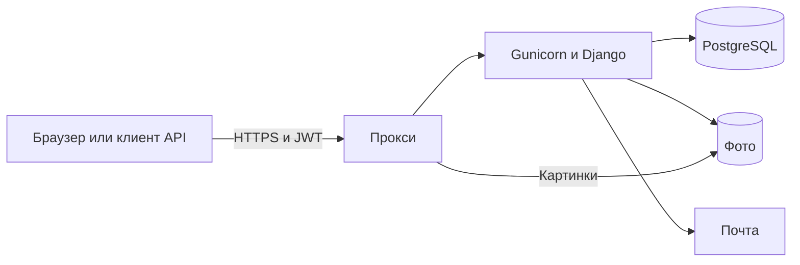
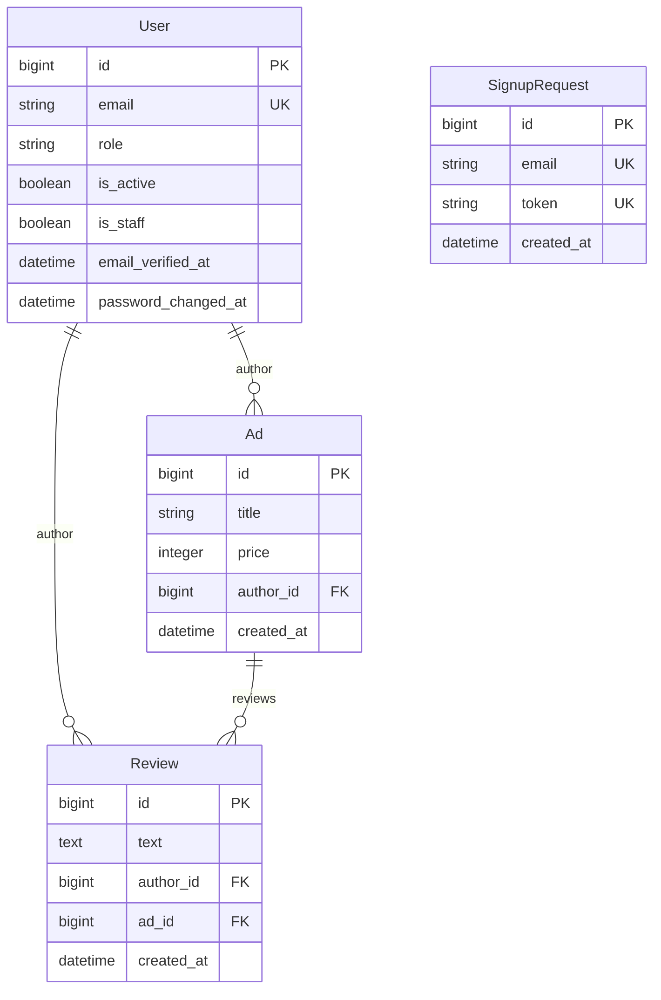

# Архитектура

У доски объявлений есть сайт и REST API. Данные хранятся в PostgreSQL.
На сервере запросы идут по HTTPS. API использует JWT, сайт и админка Django — сессии и CSRF.

Сайт (`web`) работает с моделями напрямую. Гость может открыть опубликованную
карточку на сайте; в API для просмотра карточки нужен JWT.

## Из чего состоит

| Часть | Зачем |
| --- | --- |
| `config/settings/base.py` | Общие приложения, middleware, DRF, JWT, шаблоны, пути к файлам |
| `config/settings/local.py` | Разработка: DEBUG, письма в консоль |
| `config/settings/test.py` | Тесты: быстрое хеширование паролей, письма в памяти |
| `config/settings/prod.py` | Сервер: обязательные переменные, SMTP, HTTPS, безопасные cookie |
| `config/settings/components/` | Чтение `.env`, база, почта, безопасность, логи, файлы |
| `config/urls.py`, `config/views.py` | Корневые адреса и `/health/` |
| `users/` | Заявки на регистрацию, аккаунт, роли, JWT, смена и сброс пароля, общие лимиты запросов |
| `ads/` | Объявления, фото, отзывы, права, поиск, постраничный вывод |
| `web/views/ads.py` | Каталог, карточки, отзывы и управление объявлениями на сайте |
| `web/views/accounts.py` | Вход, регистрация и сброс пароля в браузере |
| `web/views/errors.py`, `web/forms.py` | Страницы ошибок и проверка HTML-форм |
| `messaging/` | Закрытые диалоги, сообщения, страницы переписки и отметки прочтения |
| `static/` | Стили, мобильное меню, вкладки обсуждений и таймер повторного письма |
| `templates/emails/` | Письма |
| `deploy/entrypoint.sh` | Ждёт базу, применяет миграции, создаёт таблицу кэша, собирает статику, запускает приложение |

В API ViewSet или GenericAPIView проверяет вход и права пользователя.
Сериализатор проверяет данные запроса и готовит JSON-ответ, ORM работает с базой.

HTTPS на прокси настраивается при выкладке. В Compose — приложение и база.
Порт сайта слушает только `127.0.0.1`, порт Postgres наружу не открыт.

## Данные

Пользователь — своя модель, вход по email. При сохранении почта очищается от пробелов
по краям и приводится к нижнему регистру; повтор адреса проверяется без учёта регистра.
Имя, фамилия, телефон и фото необязательны. Пароль только в хеше.
Роль `admin` даёт права администратора на сайте и в API. Для входа в `/admin/`
нужен флаг `is_staff`. Сами флаги `is_staff` и `is_superuser` роль не заменяют.
Команда `createsuperuser` задаёт роль `admin` и оба флага.

До подтверждения почты данные формы находятся в `SignupRequest`, записи `User` ещё нет.
Пароль заявки хранится как хеш Django. Случайная одноразовая ссылка
`{FRONTEND_URL}/signup/confirm/<token>/` действует сутки от создания заявки.
Подтверждение блокирует заявку в транзакции, создаёт пользователя с готовым хешем
и временем подтверждения, затем удаляет заявку. Автоматического входа нет.
Повторная регистрация после паузы в 60 секунд заменяет заявку и ссылку.
Во время паузы прежняя заявка остаётся действующей. Пауза привязана к email
без учёта регистра и пробелов по краям, поэтому новая заявка её не обходит.
Каждое новое письмо запускает паузу заново; повторная отправка (resend)
не продлевает срок заявки. Просроченные заявки удаляет `purge_signup_requests`.
Расписание этой команды нужно настроить отдельно, в том числе при работе через Compose.

Сайт и API повторяют письмо через `users.signup.resend_signup_confirmation`.
Функция проверяет, что заявка ещё действует, аккаунт не создан и пауза закончилась.
Ответ не раскрывает, существует ли заявка или аккаунт.

У объявления: название до 200 символов, описание, цена — целое число от нуля.
У отзыва текст обязателен. Клиент не может подменить автора или перенести отзыв
к другому объявлению.

Удалили пользователя — исчезают его объявления и отзывы.
Удалили объявление — исчезают все отзывы под ним.

## Кто что может в API

| Действие | Гость | Чужой пользователь | Автор | Админ |
| --- | --- | --- | --- | --- |
| Список и поиск объявлений | Да | Да | Да | Да |
| Одна карточка | Нет | Да | Да | Да |
| Создать объявление | Нет | Да | Да | Да |
| Править и удалить объявление | Нет | Нет | Своё | Любое |
| Читать и писать отзывы | Нет | Да | Да | Да |
| Править и удалить отзыв | Нет | Нет | Свой | Любой |

Автор объявления не правит чужие отзывы.
Нет токена — 401. Нет прав — 403. Объекта нет — 404 после проверки входа.

Для чужого черновика или снятого объявления карточка, список отзывов и создание
отзыва закрыты. Автор уже оставленного отзыва сохраняет доступ к его отдельному
адресу для чтения, изменения и удаления; чужие скрытые отзывы и ответы ему не выдаются.
На сайте удаление своего отзыва через POST также работает, когда объявление скрыто:
после удаления пользователь возвращается в ленту, без открытия скрытой карточки.
Пустой PATCH объявления, в том числе только с read-only полями, не меняет состояние
или время отправки на рассмотрение и не отправляет письмо.

Свой профиль: `/api/users/me/`. Роль, почту, дату регистрации и id менять нельзя.
В данных автора карточки видны только id, имя и фамилия — без почты и телефона.

Профиль сохраняет только переданные редактируемые поля. Запрос, начатый до смены
пароля, прав или состояния аккаунта, не восстанавливает старые значения.
При смене пароля транзакция блокирует строку пользователя и заново проверяет
активность аккаунта и текущий пароль. Поэтому более ранний запрос не отменит
сброс пароля, который уже завершился.

## Вход

API: заголовок `Authorization: Bearer …`. Сессия сайта API не открывает.
Подпись токена — `DJANGO_SECRET_KEY`. Сроки access и refresh задаются в `.env`.
Допустимы 15–60 минут для access и 1–7 дней для refresh; по умолчанию — 60 минут
и 7 дней. При значениях вне диапазонов приложение не запускается.
Email при регистрации и входе через сайт или API приводится к нижнему регистру.
Поиск пользователя не учитывает регистр, в том числе в Django admin и для старых
записей. Если несколько старых записей совпали, вход отклоняется обычным ответом.
Такие дубликаты нужно разобрать отдельно.

Смена пароля — только со старым паролем. Восстановление — одноразовая ссылка.
Выключенный аккаунт (`is_active=false`) не входит и не сбрасывает пароль.

Чёрного списка JWT нет. Проверка токена сверяет время выдачи и отметку смены пароля
с пользователем в базе. После смены или сброса пароля прежние access и refresh
сразу отклоняются; обновление refresh также проверяет эту отметку.

Пересчёт хеша при входе не считается сменой пароля и действующие JWT не отзывает.
Новый хеш записывается только если в базе всё ещё тот, который только что проверили;
иначе побеждает более свежая смена пароля.

На сервере middleware включает CSP: основные ресурсы загружаются со своего сайта.
Для CDN страницы Swagger задано отдельное разрешение. HTTPS, безопасные cookie
и точные имена разрешённых хостов задаются в настройках сервера.

`AuthenticationRateLimitMiddleware` ограничивает POST до выполнения обработчиков.
API, короткие алиасы и HTML-формы используют общие счётчики. Вход в Django admin
учитывается вместе с остальными входами. `AUTH_REQUEST_LIMITS` задаёт фиксированные окна:
вход — 20 запросов/IP и 10/email за минуту; регистрация вместе с resend — 20/IP за минуту;
запрос сброса — 20/IP за минуту; подтверждение сброса — 30/IP за минуту.
Email в ключе кэша нормализуется и хешируется. Проверка не зависит от наличия аккаунта.
При превышении API получает JSON, сайт — страницу, оба с кодом 429 и `Retry-After`.
Ответ не кэшируется. Отдельно действует пауза 60 секунд между письмами одного типа на один email.

IP берётся из `REMOTE_ADDR`. Только при настроенном `SECURE_PROXY_SSL_HEADER`
используется крайний правый адрес `X-Forwarded-For`, дописанный доверенным прокси.
Префикс заголовка от посетителя не учитывается. Это предполагает закрытый прямой
доступ к приложению: Compose публикует его порт только на loopback.

## Сброс пароля

1. Клиент отправляет email на `POST /api/users/reset_password/`.
2. Письмо со ссылкой уходит активному пользователю с установленным паролем, если закончилась пауза 60 секунд.
3. В пределах лимита запросов ответ пустой 204, даже если адреса нет или пауза ещё действует.
4. Ссылка: `{FRONTEND_URL}/password-reset/{uid}/{token}/`.
5. Подтверждение: `uid`, `token`, новый пароль. Успех — 204, битая ссылка — 400.

Короткий `POST /users/reset_password_confirm` работает без перенаправления;
вариант с завершающим `/` также ведёт к тому же обработчику.

Ссылка живёт 24 часа. Сменили пароль — старый токен больше не действует.
Подтверждение идёт в транзакции: одну ссылку нельзя применить дважды.

Форма из письма — стандартная Django. Токен уходит из адреса в сессию,
чтобы не попасть в Referer. Сайт и API используют одну отправку писем и общую паузу.
Правила сложности задаёт `AUTH_PASSWORD_VALIDATORS`; при регистрации их вызывает
`users/validation.py`, при смене и сбросе — проверка пароля Django.

Письмо уходит сразу, очереди нет. Ошибка SMTP перехватывается: ответ клиенту остаётся
прежним, в журнал идут факт ошибки и id пользователя или заявки без адреса и ссылки.
Общие лимиты приложения действуют и при ошибках отправки. Ограничение на прокси
можно добавить как дополнительную защиту.

## Поиск и страницы

Поиск работает по части названия без учёта регистра.
В API можно задать цену «от» и «до»; неверные значения отклоняются.
Если «от» больше «до», список пуст. Полнотекстового индекса нет.

В API можно сортировать по цене или дате. При равных значениях порядок задаёт id,
чтобы записи не менялись местами между страницами. По умолчанию новые идут первыми.

Список объявлений — строго 4 карточки на страницу, клиент размер не увеличит.
Отзывы — общая пагинация DRF.
Авторов подгружаем через `select_related`.

В личке на странице 20 диалогов или 50 сообщений. Без `page` открывается последняя
страница переписки; туда же возвращает успешная отправка. Сообщения идут по `created_at`,
затем по id, по возрастанию. `Paginator` загружает только выбранную страницу.
Собеседники и авторы загружаются через `select_related`, последние тексты и признак
непрочитанного — подзапросами.

`read_at` меняется только у показанных входящих сообщений. Сообщения на других страницах
и поступившие после выборки остаются непрочитанными. Чужая переписка возвращает 404
даже администратору и ничего не отмечает прочитанным.

## Файлы

Аватар и фото объявления проверяет Pillow.
Профили: `MEDIA_ROOT/users/`.
Объявления: `MEDIA_ROOT/ads/год/месяц/`.
Аватар и фото объявления: до 5 МиБ, JPEG / PNG / WebP, расширение совпадает с содержимым.
В базе хранится относительный путь.
В разработке файлы отдаёт Django, на сервере — прокси из подключённого media. Файлы публичные.

Старый файл при замене или удалении записи сам с диска не стирается. Отдельная команда
`cleanup_media` находит изображения старше суток, на которые не ссылается ни одна запись.
Обычный запуск только перечисляет кандидатов; порядок удаления и требования к остановке
записи описаны в [DEPLOY](DEPLOY.md).
Статику в production отдаёт WhiteNoise. Медиа — нет.

## Запуск

Переменные окружения важнее файла `.env`. В образ `.env` не кладётся.

По умолчанию фото находятся в именованном томе `media_data`; при первом подключении Docker
сохраняет права каталога из образа для пользователя `10001:10001`.

Контейнер сначала ждёт базу, применяет миграции и создаёт таблицу общего кэша.
Повторное создание таблицы безопасно и не сбрасывает текущие лимиты.
Если база недоступна или один из шагов завершился ошибкой, Gunicorn не запускается.

`/health/` выполняет `SELECT 1`. Если база недоступна, ответ — `unavailable`, без паролей и хостов.

## Тесты и ограничения

Тесты проверяют API, права с настоящими JWT, срок ссылки, поиск, пагинацию
и отказ запуска при ошибке миграции. CI собирает образ и проверяет сохранность
данных после перезапуска и пересоздания контейнеров.

Вложенные URL — обычные `path`. Дубли в OpenAPI скрыты. Access log Gunicorn идёт
в stdout, ошибки Gunicorn и журналы Django — в stderr. Docker собирает оба потока.
Фильтр и форматирование в `config/logging.py`, а также класс логирования Gunicorn
в `config/gunicorn.py` маскируют чувствительные URL и Referer в записях и ошибках.
Конфигурация nginx отдельно защищает журналы прокси; настройки приложения на них
не влияют. Текст консольного письма в режиме разработки по-прежнему содержит ссылку.

Копии томов нужно делать отдельно. Запуск миграций вместе с одним web-контейнером
допустим; перед запуском нескольких реплик нужно изменить этот порядок.

Лимиты входа, регистрации, восстановления, сообщений и повторной отправки писем живут
в кэше. Compose по умолчанию задаёт
`DJANGO_CACHE_URL=database://message_rate_cache`, поэтому оба процесса Gunicorn
используют одну таблицу PostgreSQL. Таблица создаётся entrypoint до запуска процессов.
Для нескольких процессов общий кэш обязателен. Без Docker он включается той же переменной; команду
`python manage.py createcachetable` нужно выполнить самостоятельно.
Без переменной в локальном запуске и тестах используется память процесса.
